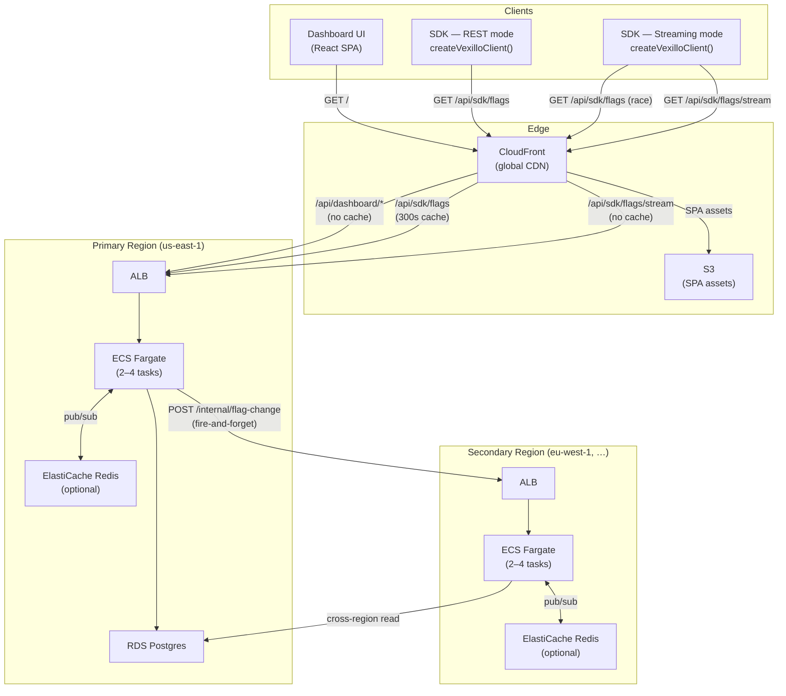
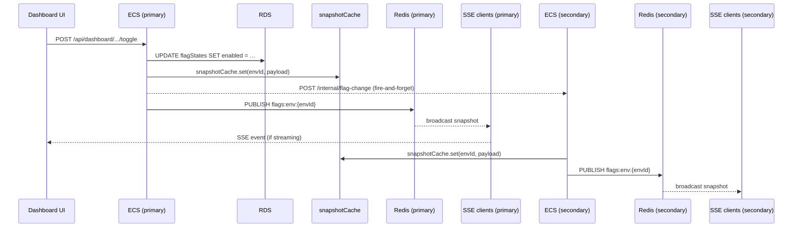
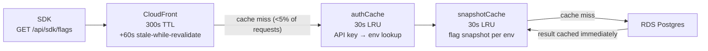
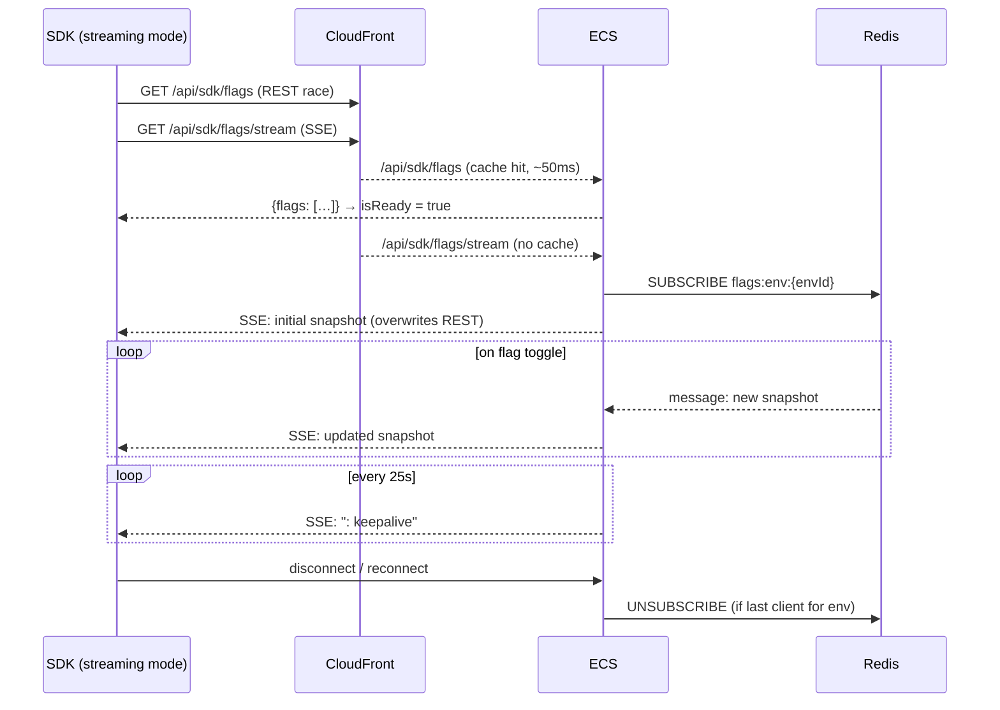

# Architecture

> Scale context: ~1M visits/month, e-commerce storefront.

---

## System Overview

---

## Flag Toggle — Propagation Flow

When an admin toggles a flag in the dashboard, updates reach all connected clients within seconds.

The fan-out to secondary regions is fire-and-forget — it does not block the primary's response. If the secondary misses an event, its `snapshotCache` expires after 30 s and the next request re-queries RDS in us-east-1 as a fallback.

---

## REST Request — Cache Layers

A REST client hitting `/api/sdk/flags` passes through three cache layers before touching the database.

At 1M visits/month, over 95% of requests are served from CloudFront without reaching ECS.

---

## Streaming — Connection Lifecycle

The REST race on connect means `isReady` is `true` and components render with real values before the SSE handshake completes. The SSE snapshot then overwrites the cached REST value once it arrives.

---

## Infrastructure Summary

| Component               | Detail                                                                                                             |
| ----------------------- | ------------------------------------------------------------------------------------------------------------------ |
| CloudFront              | Global CDN; caches `/api/sdk/flags` at edge (300 s + 60 s SWR); no cache for dashboard or SSE                      |
| ECS Fargate             | 256 CPU / 512 MB per task; 2 min, 4 max; scales at 65% CPU; 120 s idle timeout (SSE kept alive by 25 s keepalives) |
| RDS Postgres            | t4g.micro; primary region only; isolated VPC subnet; 7-day backup retention                                        |
| ElastiCache Redis       | Optional; required for multi-container SSE fan-out; one channel per environment (`flags:env:{envId}`)              |
| Secondary regions       | No RDS — read primary's DB via `DATABASE_URL`; local Redis for in-region SSE fan-out                               |
| `/internal/flag-change` | ALB-only route (not exposed via CloudFront); protected by `X-Internal-Secret` header                               |
